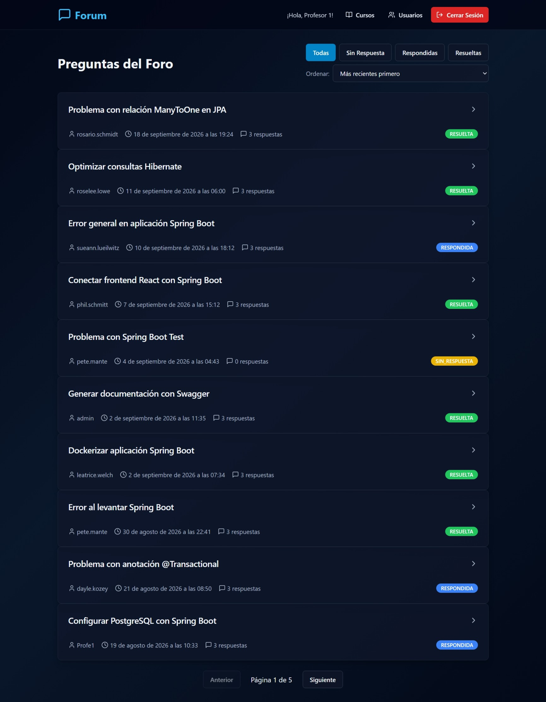

<h1 align="center">Forum</h1>
<h2 align="center">API REST para foro de discusión con autenticación JWT, gestión de usuarios, preguntas y respuestas. Incluye frontend desplegado para demostración.</h2>

El frontend permite las peticiones HTTP básicas para demostración. 

Por medio de Swagger puedes acceder a todas las peticiones HTTP.

La aplicación cuenta con un perfil demo que activa un DataSeeder automático para poblar la base de datos con 10 cursos, 3 usuarios predeterminados, 20 usuarios simulados generados con la librería de DataFaker, 50 preguntas y 120 respuestas generadas con IA.

Puedes iniciar sesión con admin, Profe1 o cualquiera de los usuarios (puedes verlos una vez que entres a la aplicación) y con la contraseña 123456.

<h2 align="center">Pruébala aquí:</h2>

<h2 align="center">Pruébala con Swagger:</h2>




<br>

Éste es un proyecto de práctica en mi formación Back-end para manejar las funcionalidades CRUD de un foro, incluyendo:

**USUARIOS:**

-crear 

-listar

-borrar.


**CURSOS:**

-crear

-listar

**TÓPICOS:**

-crear

-listar por defecto en orden por más reciente primero y listar en orden por más antiguo primero

-listar por status, por autor, o por curso

-detallar un tópico

-actualizar

-eliminar

**RESPUESTAS:**

-crear

-listar todas, por usuario o por tópico

-detallar

-editar

Se requiere autenticación para acceder a la API con autorización por medio de JSON Web Token. 
El acceso es por medio de nombre de usuario y contraseña, devolviendo un token con un tiempo de expiración de 2 horas. 
Se implementa el manejo de errores para devolver un mensaje más claro al usuario.

**La autorización** para acceder a las diferentes requisiciones se otorga a los roles de usuario de la siguiente manera:

-Inicio de sesión: TODOS

-Crear usuario: ADMINISTRADOR

-Listar usuarios: ADMINISTRADOR, PROFESOR

-Borrar usuarios: ADMINISTRADOR

-Crear un curso: ADMINISTRADOR

-Actualizar un tópico: ADMINISTRADOR, PROFESOR y el autor del tópico

-Borrar un tópico: ADMINISTRADOR, PROFESOR

-Editar una respuesta: ADMINISTRADOR, PROFESOR y el autor de la respuesta

-Todas las demás requisiciones están permitidas a los usuarios registrados con cualquier rol.

<br>

## Ejecutar la demo con Docker

Requiere Docker Desktop corriendo. 

Antes del primer inicio, crea tu archivo de configuración local a partir del ejemplo.

**Bash:**
```bash
cp .env.example .env
docker compose up --build
```
o

**PowerShell:**
```powershell
Copy-Item .env.example .env
docker compose up --build
```

Una vez creado el archivo `.env`, allí puedes establecer una contraseña de PostgreSQL y una clave JWT propias.

Abre `http://localhost:8080`. La API se expone a través del mismo origen que el frontend.
Swagger está disponible en `http://localhost:8080/swagger-ui/index.html`.

El perfil `demo` crea datos de muestra solamente en una base nueva. Puedes iniciar sesión con `admin`, `Profe1` o cualquiera de los usuarios (éstos los puedes ver una vez que entres a la aplicación) con la contraseña `123456`.

Para reiniciar completamente los datos de demostración:

**Bash/PowerShell:**
```bash
docker compose down -v
docker compose up --build
```


<br><br><br>


<h2>Tecnologías utilizadas:</h2>
<h2>Java 17</h2>
<h2>Spring Boot 3.0.0</h2>
<h2>Maven 4.0.0</h2>
<h2>Flyway</h2>
<h2>Lombok</h2>
<h2>Java JWT 4.5.0</h2>
<h2>Spring Doc 2.5.0</h2>


